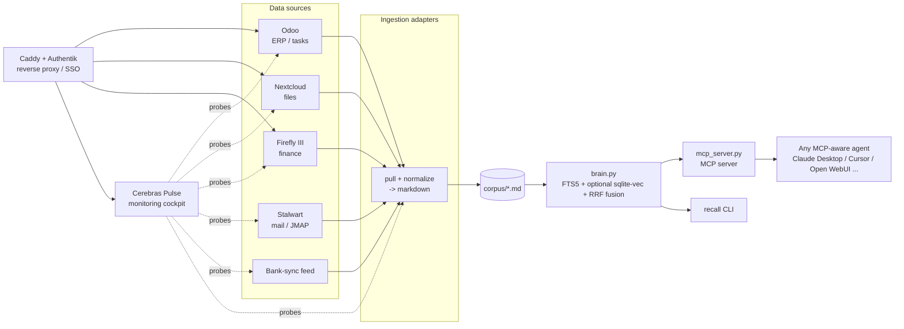

# Atlas Second Brain Stack

[](LICENSE)
[](docker-compose.yml)
[](docs/04-second-brain.md)

A self-hosted **"second brain"**: a single-file SQLite recall engine (FTS5
lexical search, optional dense/semantic vectors via `sqlite-vec`, fused with
Reciprocal Rank Fusion) that turns your own data — Odoo tasks, Nextcloud
files, Firefly III finance, Stalwart mail, bank feeds, whatever you point it
at — into something you can actually ask questions of, with zero vector-DB
service and zero per-query API cost. Alongside it runs **Cerebras Pulse**, a
small monitoring cockpit that watches the health of every connector feeding
the brain and gates any self-heal action behind human approval. Both ship as
Docker services behind Caddy (automatic HTTPS) and Authentik (SSO), so the
whole stack — data sources, recall engine, and monitoring — comes up together
on one box.

This repo is the sanitized, generic, reproducible version of a real
production deployment. See [SANITIZATION-REPORT.md](SANITIZATION-REPORT.md)
for exactly what was genericized and why.

## Architecture



Everything runs behind Caddy (TLS termination) with Authentik providing SSO
via `forward_auth`, so individual services don't implement their own login.

## Quickstart

```bash
git clone <this-repo-url> atlas-secondbrain-stack
cd atlas-secondbrain-stack

# 1. Configure — every value ships empty, nothing here is a real secret/domain
cp .env.example .env
# edit .env: set DOMAIN, generate AUTHENTIK_SECRET_KEY / FIREFLY_APP_KEY, etc.

# 2. Bring the stack up
docker compose up -d

# 3. First ingest — point the brain at some of your own text/markdown
docker compose exec secondbrain python3 brain.py init
docker compose exec secondbrain python3 brain.py ingest-files ./corpus

# 4. First recall
docker compose exec secondbrain python3 brain.py recall "renewal date for the X contract" --hybrid
```

Read [docs/01-vps-foundation.md](docs/01-vps-foundation.md) before your first
`docker compose up` on a real host — it covers DNS, Caddy, and Authentik
bootstrap, which every other piece depends on.

## Repository layout

```
.
├── docker-compose.yml        # full reference stack: edge, data sources, brain, pulse
├── .env.example              # every var ships empty — copy to .env and fill in your own
├── secondbrain/              # the recall engine (brain.py, mcp_server.py, ingestion CLI)
├── cerebras/                 # Cerebras Pulse: FastAPI + HTMX monitoring cockpit
├── docs/                     # numbered build guides, 01 through 06 (see below)
├── SANITIZATION-REPORT.md    # what was genericized when this repo was assembled
└── LICENSE                   # MIT
```

## Documentation

| Doc | Covers |
|---|---|
| [01 — VPS Foundation](docs/01-vps-foundation.md) | Docker + Caddy (automatic HTTPS) + Authentik (SSO via `forward_auth`) — the base every other piece sits on |
| [02 — Data Containers](docs/02-data-containers.md) | Odoo (tasks/ERP), Nextcloud (files), Firefly III (finance) as standard upstream images behind the foundation |
| [03 — Mail: Stalwart](docs/03-mail-stalwart.md) | Self-hosted SMTP/IMAP/JMAP mail server, exposing JMAP so ingestion can pull mail without scraping IMAP |
| [04 — The Second Brain](docs/04-second-brain.md) | `brain.py` engine internals: chunking, secret-scrubbing, FTS5, optional dense vectors, RRF fusion, the MCP server, and the autonomy/proposal loop |
| [05 — Cerebras Pulse](docs/05-cerebras-pulse.md) | The monitoring cockpit: config-as-data connector probes, red/amber/green tiles, and the gated propose→approve→execute self-heal pipeline |
| [06 — Ingestion](docs/06-ingestion.md) | The adapter pattern (pull → normalize → markdown → `corpus/`) with a complete worked JMAP-mail example and scheduling via cron/systemd |

## Security note

This repo ships with **no secrets, no real domains, and no real IPs** —
`.env.example` lists every variable used across the stack with an empty
value and an explanatory comment; `docker-compose.yml` and `connectors.yaml`
reference only placeholders like `your-domain.tld`. Before you go further:

- Copy `.env.example` to `.env`, fill in your own values, and **never commit
  `.env`** — it's already excluded via `.gitignore`.
- Generate real secrets yourself (`openssl rand -base64 48` for
  `AUTHENTIK_SECRET_KEY`, etc.) — do not reuse anything from this repo or its
  docs.
- The brain's `scrub()` step is a best-effort regex net for *secrets* (API
  keys, tokens, private-key blocks), not a PII-redaction guarantee — treat
  `store/brain.db` as sensitive operational data regardless, and never commit
  it (it's gitignored by design).
- See [SANITIZATION-REPORT.md](SANITIZATION-REPORT.md) for the full audit
  trail of what was found and genericized when this public repo was
  assembled from the original private deployment.

## License

[MIT](LICENSE)

---

Built by Atlas SHB.
