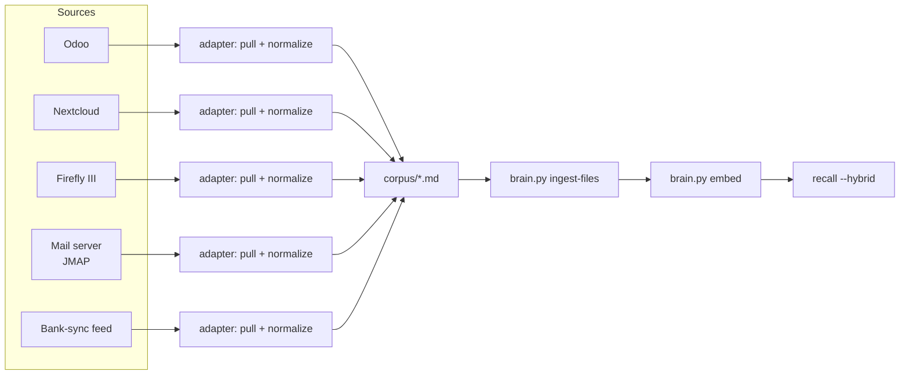

# 06 — Ingestion: gather it for the Second Brain

The Second Brain doesn't talk to your other services directly. Every source gets a
small **adapter** that pulls data, normalizes it to plain markdown, and drops it in
`corpus/` — then the standard `brain.py ingest-files` + `embed` steps pick it up like
any other file. This keeps the brain decoupled from every upstream API: add or remove a
source without touching the recall engine at all.



## The adapter pattern

Every adapter follows the same four steps, regardless of source:

1. **Pull** — call the source's API (read-only credentials, least privilege)
2. **Normalize** — turn each record into a short markdown document with a stable
   filename (so re-runs overwrite rather than duplicate) and a front-matter-ish header
   (source, id, timestamp) so the recall result is traceable back to origin
3. **Write** — drop it under `corpus/<source>/<id>.md`
4. **Index** — run `ingest-files` + `embed` (usually via `feed.sh` on a timer, not
   invoked per-adapter)

Keep adapters **read-only against the source** and **idempotent** (same input → same
output file, overwritten in place) so re-runs are safe and cheap.

### Odoo (ERP / tasks)

Pull via Odoo's XML-RPC or JSON-RPC API (read-only user). Typical objects worth
ingesting: `project.task` (open tasks/status), `res.partner` (contacts, sanitized),
`account.move` (invoice metadata — amounts/dates/status, not full PII). One markdown
file per record or one per day-batch of updates, e.g.:

```markdown
# Odoo task #4821 — "Renew hosting contract"
project: Ops | stage: In Progress | updated: 2026-07-10
assignee: <redact or keep per your PII policy>

<task description body, normalized to plain text>
```

### Nextcloud (files)

Pull via WebDAV (`PROPFIND` for listing, `GET` for content) with an app-password-scoped
account. For office documents, extract text first (e.g. `pandoc`/`textract`) — the
brain ingests text, not binary files. Emit one markdown file per source document,
carrying the original path as a header line so recall results point back to "where do I
find this in Nextcloud."

### Firefly III (personal/business finance)

Pull via Firefly's REST API (`/api/v1/transactions`, personal access token, read-only
scope is sufficient). Normalize each transaction or a periodic rollup into markdown —
amount, date, category, counterparty, description — so recall can answer "when did we
last pay X" or "what's the recurring cost of Y" from plain-language queries.

### Stalwart mail (JMAP)

Pull via [JMAP](https://jmap.io) (`urn:ietf:params:jmap:mail` capability) against your
mail server's JMAP endpoint. One markdown file per message (or per thread), subject +
sender + date + a plain-text body extract. See the complete example below.

### Bank-sync feed

Whatever produces your transaction feed (a scraper, a PSD2/open-banking client, an
export-and-parse job) — treat it like Firefly III above: normalize each line to a
markdown record with date/amount/counterparty/reference, drop it in `corpus/bank/`.
Since bank data is sensitive, apply your own PII policy before writing to `corpus/` —
the brain's built-in `scrub()` targets *secrets* (keys/tokens), not financial PII.

## Complete example: JMAP mail → markdown adapter

All connection details come from environment variables — nothing is hardcoded. This is
the full adapter (~40 lines); wire in your own field mapping if your JMAP server
exposes richer metadata.

```python
#!/usr/bin/env python3
"""adapters/jmap_mail_to_corpus.py — pull recent mail via JMAP, write to corpus/mail/.
Env (all required, no defaults — fail loudly if unset):
  JMAP_ENDPOINT   e.g. https://mail.your-domain.tld/jmap/session
  JMAP_USER       mail login
  JMAP_PASSWORD   app password / API token (never the account's main password)
  CORPUS_DIR      e.g. /opt/app/secondbrain/corpus
"""
import os, sys, json, re, pathlib, requests

ENDPOINT = os.environ["JMAP_ENDPOINT"]
USER     = os.environ["JMAP_USER"]
PASSWORD = os.environ["JMAP_PASSWORD"]
OUT      = pathlib.Path(os.environ["CORPUS_DIR"]) / "mail"
LIMIT    = int(os.environ.get("JMAP_FETCH_LIMIT", "200"))

def _slug(s: str) -> str:
    return re.sub(r"[^a-zA-Z0-9]+", "-", s).strip("-")[:80] or "untitled"

def main():
    auth = (USER, PASSWORD)
    session = requests.get(ENDPOINT, auth=auth, timeout=30).json()
    api_url = session["apiUrl"]
    account_id = next(iter(session["accounts"]))

    body = {
        "using": ["urn:ietf:params:jmap:core", "urn:ietf:params:jmap:mail"],
        "methodCalls": [
            ["Email/query", {"accountId": account_id,
                              "sort": [{"property": "receivedAt", "isAscending": False}],
                              "limit": LIMIT}, "q"],
            ["Email/get", {"accountId": account_id,
                            "#ids": {"resultOf": "q", "name": "Email/query", "path": "/ids"},
                            "properties": ["subject", "from", "receivedAt", "preview"]}, "g"],
        ],
    }
    resp = requests.post(api_url, auth=auth, json=body, timeout=60).json()
    emails = resp["methodResponses"][1][1]["list"]

    OUT.mkdir(parents=True, exist_ok=True)
    for e in emails:
        frm = (e.get("from") or [{}])[0].get("email", "unknown")
        subj = e.get("subject") or "(no subject)"
        fname = OUT / f"{e['id']}-{_slug(subj)}.md"
        fname.write_text(
            f"# Mail: {subj}\n\nfrom: {frm}\nreceived: {e.get('receivedAt','')}\n\n"
            f"{e.get('preview','')}\n", encoding="utf-8")
    print(f"[jmap-mail] wrote {len(emails)} messages -> {OUT}")

if __name__ == "__main__":
    main()
```

Run it, then feed the brain as usual:

```bash
export JMAP_ENDPOINT=https://mail.your-domain.tld/jmap/session
export JMAP_USER=you@your-domain.tld
export JMAP_PASSWORD=<app-password>       # never the account's main password
export CORPUS_DIR=/opt/app/secondbrain/corpus

python3 adapters/jmap_mail_to_corpus.py
python3 brain.py ingest-files "$CORPUS_DIR/mail"
python3 brain.py embed --limit 2000
python3 brain.py recall "email about the renewal" --hybrid
```

## Scheduling: run feeds periodically

Bundle each adapter call plus the standard `ingest-files` / `embed` pass into one script
(this is what `feed.sh` in the secondbrain/ directory already does for the corpus you
maintain by hand) and run it on a timer. Two equivalent options:

### cron

```cron
# /etc/cron.d/secondbrain-feed — every 15 minutes, locked against overlap
*/15 * * * * app  flock -n /opt/app/secondbrain/logs/.feed.lock /opt/app/secondbrain/feed.sh >> /opt/app/secondbrain/logs/feed.log 2>&1
```

### systemd timer (preferred on systemd hosts — proper logging + status)

`/etc/systemd/system/secondbrain-feed.service`:

```ini
[Unit]
Description=Second Brain ingestion feed

[Service]
Type=oneshot
User=app
EnvironmentFile=/opt/app/secondbrain/.env
WorkingDirectory=/opt/app/secondbrain
ExecStart=/opt/app/secondbrain/feed.sh
```

`/etc/systemd/system/secondbrain-feed.timer`:

```ini
[Unit]
Description=Run the Second Brain feed every 15 minutes

[Timer]
OnBootSec=2min
OnUnitActiveSec=15min
AccuracySec=30s

[Install]
WantedBy=timers.target
```

```bash
sudo systemctl enable --now secondbrain-feed.timer
systemctl list-timers secondbrain-feed.timer     # verify next run is scheduled
journalctl -u secondbrain-feed.service -n 50      # verify last run succeeded
```

**Verification:** after the first scheduled run, confirm new chunks landed and are
searchable:

```bash
python3 brain.py stats                    # chunk/embedded counts should have grown
python3 brain.py recall "<something you know just came in>" --hybrid
```
